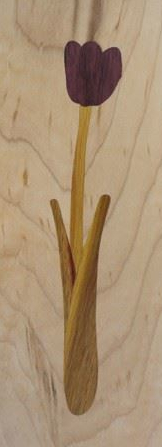

# How to do inlays on the laser

Occasionally I do laser cut inlays with thin woods.  It feels like every time I have had to re-learn how to make the inlays perfect accounting for the kerf of the laser.  I put together the svg file [InlayAndOutset.svg](InlayAndOutset.svg) that completely explains the problem and solution that I find very helpful to review before doing a laser inlay.  

